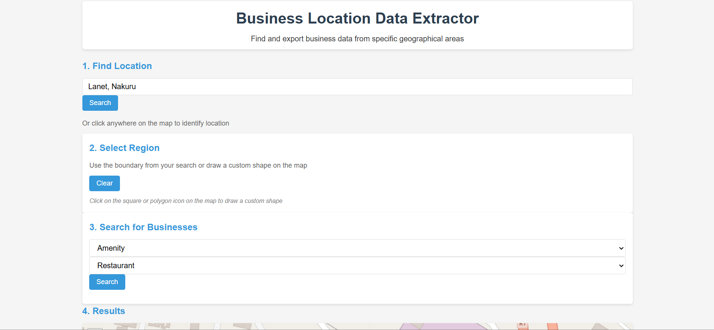
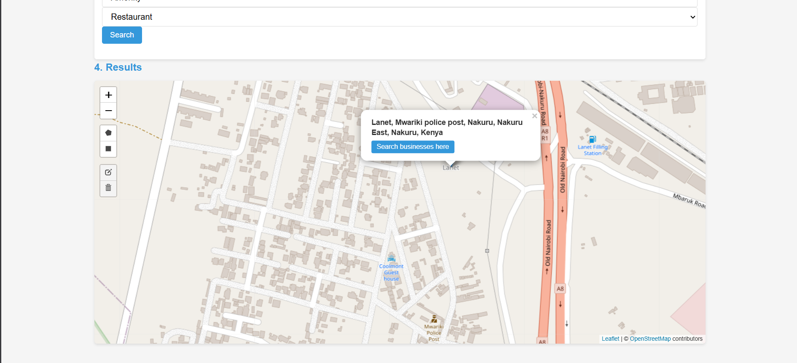
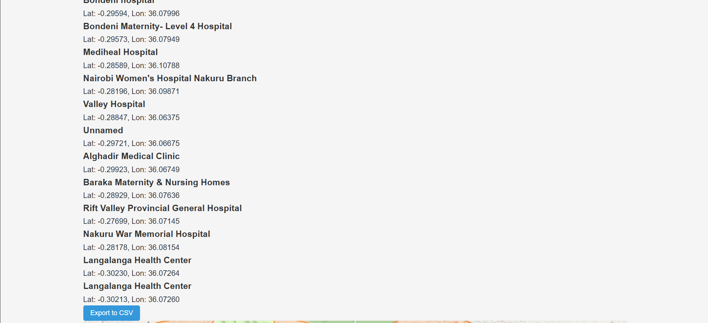

# Business Location Extractor 🗺️

A web-based geospatial data extraction system that enables users to discover and analyze business locations within specified geographic areas using OpenStreetMap data.



## 🌟 Features

- **Interactive Map Interface**: Click on the map or search by location name
- **Flexible Business Search**: Choose from predefined categories or enter custom business types
- **Data Extraction**: Extract businesses within a configurable radius (100-5000m)
- **Export Functionality**: Download results as CSV files for further analysis
- **Real-time Visualization**: See business locations as interactive markers on the map


## 📸 Screenshots

### Search Interface


### Export Feature


## 🛠️ Technologies Used

### Frontend
- HTML5, CSS3, JavaScript (ES6+)
- Leaflet.js for interactive maps
- OpenStreetMap tiles

### Backend
- Python 3.8+
- Flask web framework
- Pandas for data processing
- Requests for API communication

### APIs
- OpenStreetMap Overpass API
- Nominatim Geocoding Service

## 📋 Prerequisites

Before running this project, make sure you have:

- Python 3.8 or higher
- pip (Python package manager)
- A modern web browser (Chrome, Firefox, Safari, Edge)

## ⚙️ Installation

1. **Clone the repository**
```bash
   git clone https://github.com/Faustine254/business-location-extractor.git
   cd business-location-extractor
```

2. **Create a virtual environment** (recommended)
```bash
   python -m venv venv
   
   # On Windows
   venv\Scripts\activate
   
   # On macOS/Linux
   source venv/bin/activate
```

3. **Install dependencies**
```bash
   pip install -r requirements.txt
```

4. **Run the application**
```bash
   python app.py
```

5. **Access the application**
   
   Open your browser and navigate to: `http://127.0.0.1:5000`

## 📖 Usage

1. **Select a Location**
   - Type a location name in the search box and click "Search", OR
   - Click directly on the map to select a location

2. **Configure Your Search**
   - Choose a business type from the dropdown or enter a custom type
   - Select the search category (amenity, shop, or both)
   - Set your desired search radius in meters

3. **Extract Data**
   - Click "Extract Business Data"
   - View results in the table and on the map
   - Click on any result to zoom to that location

4. **Export Results**
   - Click "Export to CSV" to download your data
   - Files are automatically named with timestamps
  
    NEW FEATURES ADDED

**Auto-Boundary Detection**

When you search for an area by name, the system automatically:
- Maps out the geographical boundary
- Displays it on the map
- Makes that boundary available for business searches without requiring drawing

**Click-to-Identify Areas**
Simply click anywhere on the map to:
- Identify the area/region at that location
- Display its name and boundary
- Set it as the active search area

**Flexible Region Selection**
Now you have three ways to select a region:
- Search by name (automatic boundary)
- Click on the map to identify an area
- Draw custom shapes (rectangle or polygon)

**Search Without Drawing**
- Drawing shapes is now optional
- You can search businesses directly in the boundary of an area you've found
- "Search businesses here" button appears in popups after identifying an area
   
   

## 🗂️ Project Structure
business-location-extractor/
├── app.py                 # Flask application and API endpoints
├── requirements.txt       # Python dependencies
├── README.md             # Project documentation
├── .gitignore            # Git ignore rules
├── templates/
│   └── index.html        # Main HTML template
└── static/
├── css/
│   └── style.css     # Styling
└── js/
└── script.js     # Frontend logic

## 🎯 API Endpoints

- `GET /` - Render main application page
- `POST /search_location` - Search for a location by name
- `POST /extract_businesses` - Extract business data
- `POST /export_csv` - Export data to CSV

## 🔧 Configuration

The application uses default settings that work out of the box. If you need to customize:

- **Port**: Modify `app.run()` in `app.py`
- **Debug mode**: Set `debug=False` for production
- **Map center**: Change default coordinates in `script.js`

## 🤝 Contributing

Contributions are welcome! Please feel free to submit a Pull Request.

1. Fork the project
2. Create your feature branch (`git checkout -b feature/AmazingFeature`)
3. Commit your changes (`git commit -m 'Add some AmazingFeature'`)
4. Push to the branch (`git push origin feature/AmazingFeature`)
5. Open a Pull Request

## 📝 License

This project is licensed under the MIT License - see the [LICENSE](LICENSE) file for details.

## 🙏 Acknowledgments

- [OpenStreetMap](https://www.openstreetmap.org/) for providing free geographic data
- [Leaflet.js](https://leafletjs.com/) for the interactive map library
- [Flask](https://flask.palletsprojects.com/) for the web framework

## 📧 Contact

- Email: faustinemarucha@gmail.com
- LinkedIn: [Faustine Marucha](www.linkedin.com/in/faustine-marucha-184077348)
Project Link: [https://github.com/Faustine254/business-location-extractor](https://github.com/yourusername/business-location-extractor)

## 🔮 Future Enhancements

- [ ] User authentication and saved searches
- [ ] Batch location processing
- [ ] Advanced filtering options
- [ ] Data visualization with charts
- [ ] Integration with additional data sources
- [ ] Mobile app version

---

⭐ If you found this project helpful, please consider giving it a star!
